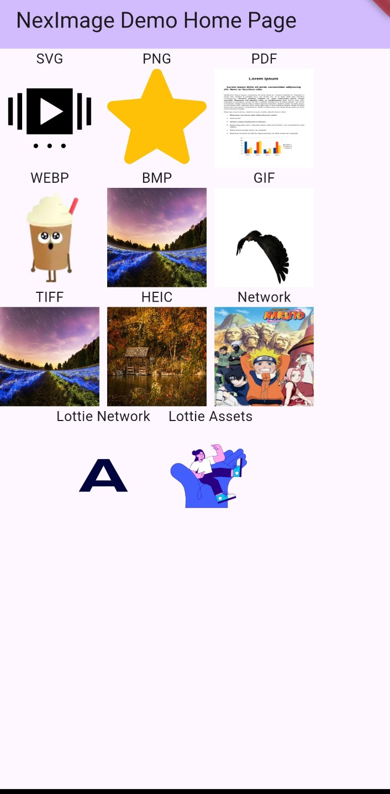

# NexImage

NexImage is a Flutter widget that simplifies image rendering and animation support across various formats, both from assets and network sources. This library provides automatic asset image detection, supports Lottie animations, handles network images efficiently, and can even convert PDFs to images. It aims to streamline the process of displaying multiple image formats in Flutter applications.

## Features

- **Automatic Asset Image Detection**: Easily detects and renders different image formats directly from the asset files.
- **Lottie Animation Support**: Displays Lottie animations from both asset files and network URLs.
- **Network Image Support**: Efficiently loads network images using `CachedNetworkImage` for optimized caching and performance.
- **PDF to Image Conversion**: Converts the first page of a PDF into an image for quick display.
- **Multiple Image Extension Support**: Handles various image formats including SVG, PNG, BMP, GIF, WEBP, TIFF, HEIC, and more.

## Screenshots



## Installation

Add `nex_image` to your `pubspec.yaml` file:

```yaml
dependencies:
  nex_image: ^1.0.0
```

Then, run:

```bash
flutter pub get
```

## Usage

Here's how to use the `NexImage` widget to display different types of images:

### Displaying Asset Images

```dart
import 'package:nex_image/nex_image.dart';

Column(
  children: [
    Text('PNG Image'),
    NexImage.asset(
      imagePath: 'assets/images/sample.png',
    ),
  ],
);
```

### Displaying Network Images

```dart
import 'package:nex_image/nex_image.dart';

Column(
  children: [
    Text('Network Image'),
    NexImage.network(
      imageUrl: 'https://example.com/sample.jpg',
    ),
  ],
);
```

### Displaying Lottie Animations

#### From Assets

```dart
import 'package:nex_image/nex_image.dart';

Column(
  children: [
    Text('Lottie Animation from Assets'),
    NexImage.lottie(
      imagePath: 'assets/animations/sample.json',
      repeat: true,
    ),
  ],
);
```

#### From Network

```dart
import 'package:nex_image/nex_image.dart';

Column(
  children: [
    Text('Lottie Animation from Network'),
    NexImage.lottie(
      imagePath: 'https://example.com/animation.json',
      repeat: true,
    ),
  ],
);
```

### Displaying PDF as Image

```dart
import 'package:nex_image/nex_image.dart';

Column(
  children: [
    Text('PDF as Image'),
    NexImage.asset(
      imagePath: 'assets/pdfs/sample.pdf',
    ),
  ],
);
```

## Supported Image Formats

- **SVG**: Scalable Vector Graphics
- **PNG**: Portable Network Graphics
- **BMP**: Bitmap Image File
- **GIF**: Graphics Interchange Format (supports animation)
- **WEBP**: WebP image format
- **TIFF**: Tagged Image File Format
- **HEIC**: High-Efficiency Image Coding
- **PDF**: Displays the first page of the PDF as an image
- **Network Images**: Any standard image format from a URL
- **Lottie Animations**: JSON-based animations

## Contribution

Contributions are welcome! Please feel free to submit issues or pull requests.

## License

This project is licensed under the MIT License. See the [LICENSE](LICENSE) file for details.

---

